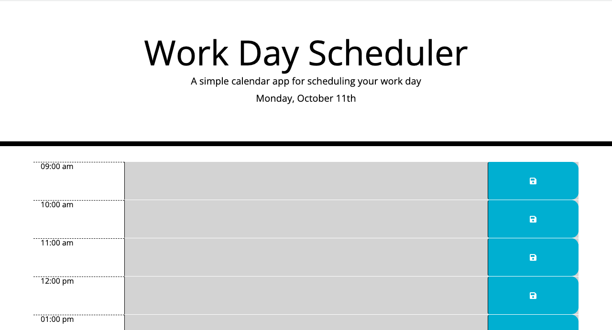
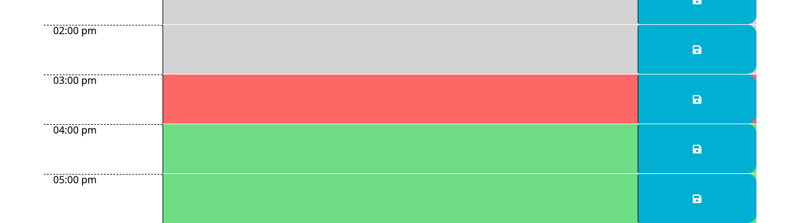

# <Day-Planner>

# Day Planner

## Summery
This project is about a simple calender that allows user to save events for typical workday (9am-5pm). The day planner blockes are colore coded to let the usetr know if it's gray meanse passed, red block shows the present time and future time blocks are green. 

## Built with

* Implement the Bootstrap grid layout in HTML.

* Integrate Bootstrap components in HTML files to quickly build user interfaces.

* Add custom styling to a CSS framework.

* Implement jQuery UI to make a webpage more user-friendly.

* Use [Moment.js ](https://momentjs.com/) to format dates and calculate time differences.

 * [HTML](https://developer.mozilla.org/en-US/docs/Web/HTML)
 * [CSS](https://developer.mozilla.org/en-US/docs/Web/CSS)
 * [JavaScript](https://developer.mozilla.org/en-US/docs/Web/JavaScript)
 * [jQuery](https://api.jquery.com/)
 * [Bootstrap](https://getbootstrap.com/)
 

## Link
 [Click here to acces to the Work Day Scheduler]().

# Table of Contents

## Some screenshots of instructions are provided in following: 

Here is what the day planner looks like: 
    

